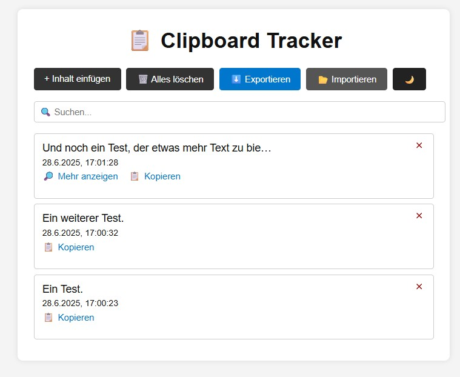

# 📋 Clipboard Tracker

Ein leichtgewichtiges Webtool zur lokalen Zwischenablage-Verwaltung – ganz ohne Backend, voll offlinefähig. Entwickelt als technisches Mini-Projekt für saubere UI, Nutzerfokus und Demo-Zwecke.

---

## 🔍 Funktionen

* 🧠 Speichert Texte aus der Zwischenablage mit Zeitstempel
* ✂️ Zeigt nur die ersten 45 Zeichen – mit **„Mehr anzeigen“** Modal
* 🗋 Pro Eintrag **„Kopieren“-Funktion**
* 🛉 Einzelnes Löschen oder **„Alle löschen“**
* 🌙 **Dark Mode** mit Toggle
* 📄 Export als `.json`-Datei
* 📅 Import von Einträgen
* 🔒 Läuft komplett lokal im Browser – keine Server, keine Abhängigkeiten

---

## 🧪 Tech Stack

* **Vanilla JavaScript**
* **HTML & CSS (mit CSS Variablen für Dark Mode)**
* Keine Frameworks, kein Build-System

---

## 🚀 Verwendung

1. Seite im Browser öffnen
2. Text in die Zwischenablage kopieren
3. Klick auf **„+ Inhalt einfügen“**
4. Optional: Suchen, Exportieren, Importieren oder Theme umschalten

> Hinweis: In Firefox zeigt sich bei mehrzeiligem Text ein Sicherheitsdialog beim Einfügen – dies ist browserbedingt und kein Fehler des Tools.

---

## 🖼 Vorschau



---

## 📁 Projektstruktur

```
clipboard-tracker/
├── index.html
├── style.css
├── app.js
└── README.md
```

---

## 📄 Lizenz

MIT – frei nutzbar, veränderbar und weiterverwendbar.
Wenn du das Tool verbesserst oder adaptierst, freue ich mich über einen Hinweis oder Link!

---

## ✨ Autor

Entwickelt & gepflegt von [Kai Dombrowski](https://kado-ber.de/)

---
